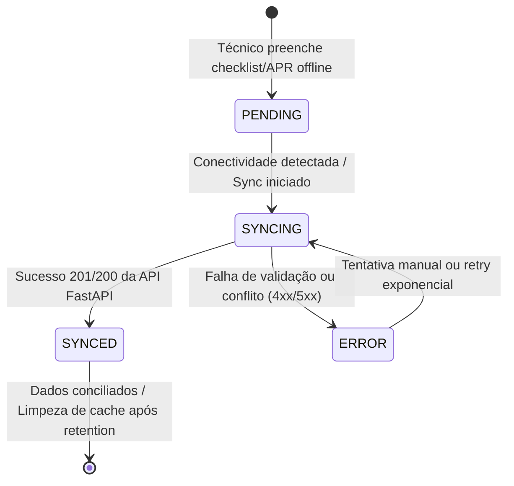

# Estratégia Offline-First — NexusOps Mobile

O aplicativo mobile **NexusOps** (`apps/mobile`), desenvolvido em React Native e Expo, é voltado ao uso por técnicos em campo para inspeções operacionais, verificação de saída de veículos e Análise Preliminar de Risco (APR). Como provedores de internet operam frequentemente em zonas rurais, porões ou áreas com cobertura de rede inexistente/instável, o padrão **Offline-First** é obrigatório na arquitetura do mobile.

---

## 1. Princípios Fundamentais do Offline-First
1. **O cliente nunca bloqueia por falta de conectividade:** Todas as ações de leitura (checklists baixados) e gravação (preenchimento de vistorias, respostas, assinaturas e fotos) são salvas imediatamente no armazenamento local do dispositivo antes de qualquer tentativa de envio ao servidor.
2. **Geração Antecipada de UUIDv4:** Quando o técnico inicia uma vistoria ou checklist offline, o aplicativo gera e atribui um identificador único universal (`UUIDv4`) localmente. Esse mesmo UUID é utilizado quando o dado é enviado e gravado no PostgreSQL, eliminando o risco de colisão de IDs ou dependência de sequências geradas pelo banco.
3. **Idempotência no Backend:** A API FastAPI foi desenhada para aceitar registros transacionados localmente sem duplicar dados em caso de reenvio por instabilidade da rede (retries da fila de sincronização).

---

## 2. Máquina de Estados da Fila de Sincronização

Cada registro criado no dispositivo mobile possui um atributo de controle de sincronização (`sync_status`) regido pela seguinte máquina de estados:

- **PENDING:** Dado armazenado localmente no SQLite/AsyncStorage aguardando sincronização.
- **SYNCING:** Fila de background em execução enviando dados ao servidor via HTTP/REST.
- **SYNCED:** Confirmação de recebimento pelo backend com persistência confirmada no PostgreSQL e MinIO.
- **ERROR:** Falha durante o envio (ex: arquivo de assinatura corrompido ou payload rejeitado pelo schema Pydantic). O item permanece na fila com log para revisão do usuário ou reprocessamento automático.

---

## 3. Fluxo de Tratamento de Mídia (Fotos, Evidências e Assinaturas)
1. **Captura Local e Otimização:** As fotos tiradas durante uma vistoria são otimizadas no próprio dispositivo (compressão JPEG/PNG para equilíbrio de qualidade e tamanho, idealmente < 1MB por evidência).
2. **Armazenamento Seguro e Vinculação:** O arquivo local é referenciado no payload JSON da vistoria através do seu caminho de sistema de arquivos e do seu UUID gerado.
3. **Sincronização em Duas Fases:**
   - **Fase 1 (Upload Binário):** Envio das fotos e assinaturas ao endpoint de storage da API, recebendo a chave do MinIO.
   - **Fase 2 (Envio de Metadados):** Envio do payload transacional da vistoria contendo as chaves das fotos já enviadas.

---

## 4. Tratamento de Conflitos e Atualizações de Templates
- **Download Diário/Periódico de Modelos:** Quando online, o aplicativo baixa para o banco local a versão mais recente das permissões, listas de veículos e templates de checklists ativos (`templates_cache`).
- **Imutabilidade do Histórico:** Se um template de checklist for alterado no servidor enquanto um técnico estiver preenching-o no modo offline, a vistoria em andamento preserva a referência exata à versão do template (`template_version_id`) vigente no momento da criação local.
