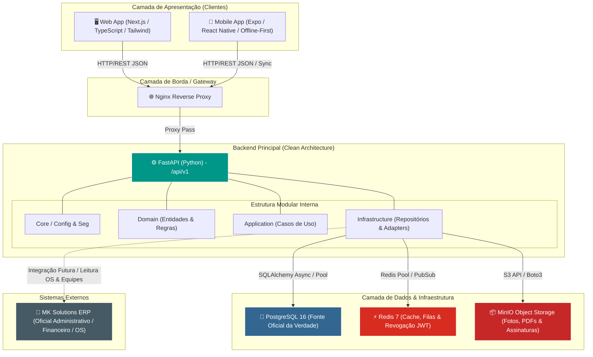

# Visão Geral da Arquitetura — NexusOps

O **NexusOps** foi projetado sob os pilares da **Clean Architecture**, **SOLID** e **API First**, promovendo baixo acoplamento e alta coesão entre seus módulos. A plataforma atua de forma especializada como sistema de conformidade operacional, mantendo fronteiras bem definidas com o ERP oficial (MK Solutions).

---

## 1. Diagrama de Arquitetura Geral (Mermaid)

---

## 2. Componentes e Responsabilidades

### 2.1 Backend (`apps/api`)
- Desenvolvido em **Python 3.11+ / FastAPI**.
- Única camada autorizada a acessar o **PostgreSQL**, **Redis** e **MinIO**.
- Implementa validação estrita de contratos via **Pydantic v2** e ORM assíncrono/síncrono com **SQLAlchemy 2.0**.
- **Geração de PDFs:** Todo laudo de vistoria, relatório ou APR é gerado exclusivamente pelo serviço FastAPI e armazenado no MinIO, registrando apenas a referência (path/ID) no banco relacional.

### 2.2 Fonte Oficial da Verdade (`PostgreSQL`)
- Armazena dados transacionais permanentes: cadastros de técnicos, veículos, templates de checklists, resumos de inspeções, logs de auditoria e não conformidades.
- Chaves primárias seguem o padrão universal `UUIDv4`.

### 2.3 Cache, Controle de Sessão e Filas (`Redis`)
- Gerencia o rate limiting e cache de consultas frequentes (como permissões RBAC do usuário).
- Armazena a **Blocklist de Tokens JWT** revogados.
- Orquestra filas assíncronas para tarefas pesadas, como geração em lote de relatórios e notificações.

### 2.4 Armazenamento de Evidências (`MinIO`)
- Object Storage compatível com AWS S3.
- Armazena fotos originais e comprimidas de checklists, assinaturas digitais coletadas no celular e PDFs gerados.

### 2.5 Aplicações Web e Mobile (`apps/web` e `apps/mobile`)
- **Web (`apps/web`):** Next.js 14+ focada na administração de checklists, gestão de APRs, auditoria de inspeções e visualização de dashboards de conformidade.
- **Mobile (`apps/mobile`):** React Native + Expo desenhado para resiliência de campo, operando localmente via armazenamento transacional offline.

---

## 3. Fluxo de Comunicação e Resiliência
1. As requisições externas passam pelo `Nginx`, que direciona o tráfego e lida com terminação SSL em produção.
2. A API valida a autenticação (JWT) consultando o cache do Redis para verificar expiração/revogação.
3. Se a requisição contiver evidências fotográficas, a camada de infraestrutura (`StorageRepository`) envia os binários ao `MinIO` e transaciona os metadados (UUID do arquivo, checksum, path) na sessão ativa do `PostgreSQL`.
